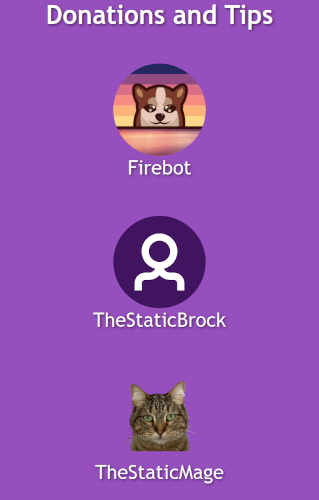
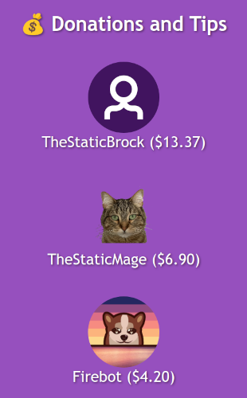

# Display Customization

## Introduction

<table>
    <tr>
        <td align="center">
            <p>Default Display</p>
            
        </td>
        <td align="center">
            <p>Customized Display</p>
            
        </td>
    </tr>
</table>

How'd I do that? This document is intended to help you tweak the format of the credits roll so that it is truly yours.

## Relevant files

There are two files that you can modify to customize the display (without digging deeply into the code).

- [`credits-config.js`](/static/credits-config.js) is responsible for the operations:
  - The sections included in your credits roll
  - How fast the credits scroll
  - The headers for each section
  - How the entries in each section are sorted (alphabetically or by amount)
  - The text and layout of each entry
  - Limit on the number of entries in a section

- [`credits.css`](/static/credits.css) controls the visuals:
  - Width of the credit roll
  - Colors on the credit roll
  - Size of each displayed image
  - Fonts used for each element

If you want to customize one or both of these files, you should do the following:

1. Download the current version of the file (click the link above) to a directory on your computer where you can easily find it later. (Many people keep their OBS assets in a particular directory. That is a good place to put these files too.)

2. Find the **Credit Generator: Generate Credits** effect that you added to the preset effect list during [installation](/doc/installation.md#configuration-roll-credits-in-firebot) and edit its settings. Select the `credits-config.js` and/or `credits.css` files that you downloaded.

3. Customize the file(s) as desired. The next sections describe customization of each file.

## Customizing the operation (`credits-config.js`)

The `credits-config.js` file defines two JavaScript constants:

- `config` contains global configuration. The values provided here are reasonable defaults, but they can be tweaked by you. In practice, these settings generally do not need to be changed. There are extensive comments in the file as to what each setting does.

- `sectionsConfig` is intended to be customized by you. The [default setup](/static/credits-config.js) contains several Twitch-related sections and sorts the users in alphabetical order. This will look very much like the "Default Display" at the top of this page. This is the section you will modify to make this your own.

The `sectionsConfig` is an Array of the following objects:

| Field | Data Type | Required? | Description |
| --- | --- | --- | --- |
| `key` | String | REQUIRED | Must match with the key name from the credit registration. This will either be one of the built-in keys ('cheer', 'donation', 'extralife', 'existingAllSubs', 'existingFollowers', 'existingGiftedSubs', 'existingGifters', 'existingPaidSubs', 'follow', 'gift', 'moderator', 'raid', 'sub', 'vip') or a [custom credit type](/doc/custom-credits.md). You may append `ByAmount` to any key name to sort by amount (e.g. `giftByAmount`). |
| `header` | String | REQUIRED | The header as it displays on the credits roll. |
| `durationPerCategory` | Integer | Optional | Override the value of `durationPerCategory` for this section only. This amount will be added to the total duration if any entries are displayed for this section. |
| `durationPerUser` | Integer | Optional | Override the value of `durationPerUser` as it pertains to counting entries for this section only. (For example, if you are not including images, you don't need as long of a duration since there is less vertical space needed to display only a name.) |
| `html` | String | Optional | Override the HTML for entries in this section only. You can use any of the placeholders detailed later. |
| `htmlFunction` | Function | Optional | Write your own function to generate the HTML for entries in this section only. This is for advanced users already familiar with JavaScript. Details are below. |
| `imageClass` | String | Optional | Override the class name for the image for entries in this section only. This is only useful if you create a corresponding entry in [`credits.css`](/browser-source-files/credits.css). |
| `limit` | Integer | Optional | Limit the number of users displayed for this credit type. If not specified, all users who have received this credit type will be displayed. (For example, you might want to do a "top 5" in a category where there are lots of users.) |

### Customizing HTML

You can customize the HTML for each entry by providing `html`.

This is the default:

```html
{image}<p class="user-display-name">{displayName}</p>
```

The `html` field allows the use of placeholders, indicated with `{curly braces}`.

The following placeholders are available:

| Placeholder | Description | Example |
| --- | --- | --- |
| `{amount}` | Total amount of credits for the user in this section | `0` or `1` or `69` or ... |
| `{displayName}` | User's display name with preferred capitalization | `TheStaticMage` |
| `{image}` | HTML image element for user's profile image | `` |
| `{profilePicUrl}` | URL to the user's profile image | `https://static-cdn.jtvnw.net/jtv_user_pictures/6b719dee-2b01-41ff-99b6-9138c7d9b2f3-profile_image-300x300.png` |
| `{username}` | User's Twitch username | `thestaticmage` |

Here is an example of sorting viewers who cheered with bits by amount (highest first) and displaying the total amount of bits each one used in the stream in parentheses after their name.

```javascript
const sectionsConfig = [
    {
        "header": "Cheers and Bits",
        "key": "cheerByAmount",
        "html": '{image}<p class="user-display-name">{displayName} ({amount})</p>'
    }
];
```

### Customizing HTML via a function

For absolute control over the display of an entry, you can provide `htmlFunction` as a JavaScript function. It is assumed that the reader has sufficient knowledge of [JavaScript](https://www.w3schools.com/js/) to write the desired code.

The function must take as its input the entry from the credits generator script and output a string with HTML. For example:

```javascript
function (entry) {
    return `<p>...Some more information here...</p>`;
}
```

The `entry` parameter corresponds to the output from the credit generator script. Each `entry` will have the following fields:

| Field | Data Type | Description |
| --- | --- | --- |
| `amount` | Number | Total amount of credits for the user in this section |
| `displayName` | String | User's display name with preferred capitalization |
| `profilePicUrl` | String | URL to the user's profile image |
| `username` | String | User's Twitch username |

Here is an example of a function that formats the user's donations as dollars and cents (e.g. `$4.20`):

```javascript
const sectionsConfig = [
    {
        "header": "Donations and Tips",
        "key": "donationByAmount",
        "htmlFunction": (entry) => {
            const formattedAmount = entry.amount.toLocaleString('en-US', {
                style: 'currency',
                currency: 'USD'
            });
            return '{image}<p class="user-display-name">{displayName} (%formattedAmount%)</p>'
                .replace('%formattedAmount%', formattedAmount);
        }
    }
];
```

:bulb: Any unresolved placeholders in the returned string will be replaced as described in the previous section.

## Customizing the visuals (`credits.css`)

The `credits.css` file controls fonts, colors, alignments, sizes, and the like. There are extensive comments in the file to explain what each class is used for. The following annotated image serves to provide additional guidance:


:bulb: It is assumed that the reader has sufficient knowledge of [CSS](https://www.w3schools.com/css/css_intro.asp) to make the desired adjustments.

Note: If you want to change the layout of the entries, e.g. _not_ display images, display names above the images, etc., then you may need to modify the HTML code and not the CSS. Some of this can be achieved as documented above ([Customizing the operation](#customizing-the-operation-credits-configjs)).

## Advanced customization

You can also customize the [`credits.js` script](/static/credits.js) or the [`credits.html` file](/static/credits.html) in the same way as above -- download these files to some directory and point the **Credit Generator: Generate Credits** file at them. You should only attempt this if you really know what you're doing, and you're familiar with HTML and JavaScript. The script authors cannot offer much support if you have problems after modifying these files.
